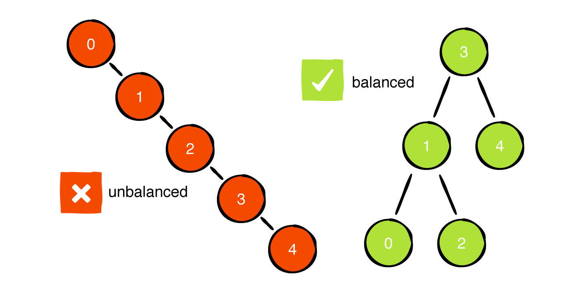

# Project 5: AVL Trees

**Due: November 8, 2024 @ 9:00pm EST**

_This is not a team project. Do not copy someone else’s work._

## Assignment Overview

[AVL trees](https://en.wikipedia.org/wiki/AVL_tree), named after computer scientists Georgy Adelson-Velsky and Evgenii Landis who introduced them in 1962, are a type of self-balancing [binary search tree (BST)](https://en.wikipedia.org/wiki/Binary_search_tree) designed to maintain operations in logarithmic time irrespective of data insertion and deletion patterns. Their introductory paper, "[An algorithm for the organization of information](https://zhjwpku.com/assets/pdf/AED2-10-avl-paper.pdf)," stands as a testament to their enduring relevance, especially in applications requiring a space-efficient data structure with quick insertion, search, and deletion capabilities.


A critical issue often encountered with traditional BSTs is their tendency to become _unbalanced_ depending on the order of data insertion and deletion, leading to operations taking linear time instead of logarithmic. For instance, inserting data in a sorted (or reverse-sorted) sequence results in a BST that resembles a linked list, with leaves growing predominantly in one direction.



While this may not pose significant challenges with small datasets, the performance gap between logarithmic and linear time becomes staggeringly evident when dealing with large databases comprising thousands or millions of records.


By self-balancing, AVL trees ensure that operations consistently take logarithmic time, providing a robust solution to the issues faced by traditional BSTs. In this project, you are tasked with implementing both a traditional BST and an AVL tree from the ground up in Python. Utilizing the AVL tree, you will address a machine learning-inspired application problem.

## Assignment Notes

1. **Generators for Space-Efficient Traversal**: In this project, you will employ Python `Generator` objects for tree traversal. This approach is notably space-efficient compared to returning a list of nodes (`List[Node]`), as it consumes _O(1)_ space instead of _O(n)_. Generators yield nodes sequentially and on-demand, providing a streamlined and memory-efficient solution. For a comprehensive introduction to Python generators, you can refer to [this article](https://realpython.com/introduction-to-python-generators/).

2. **Updating Heights and Balancing**: A prevalent mistake in this project is the omission or incorrect update of node heights, as well as improper tree rebalancing within insert and remove functions. Ensure to meticulously read the notes we've provided under each function's description in the specifications. Reflect on how recursion and the call stack can be leveraged to rebalance the tree, especially in relation to the node you've just inserted or removed.

3. **Simplifying AVL Trees**: While AVL Trees are inherently complex, breaking down each function into specific cases or checks can significantly simplify the implementation. Consider all possible scenarios for each operation, such as checking if the node you're working on is the root, or verifying the presence of a right node before proceeding with `node.right`. Ensure that you're updating the correct pointers throughout the process.

4. **Leveraging the Debugger**: Don’t hesitate to use the debugger; it is an invaluable tool, especially for deciphering the behavior of complex functions. Taking the time to familiarize yourself with its features will pay off, helping you verify whether your code is executing as expected and identifying any discrepancies in your logic.

5. **Utilizing Visualization Functions**: To aid in understanding your tree's structure, we have provided visualization and printing functions. You can easily visualize your tree by calling `tree.visualize()` on an instance of BinarySearch, AVLTree, or NearestNeighborClassifier. While we've done our best to ensure the accuracy of these visualizations, we acknowledge that they may not be flawless. If you encounter any issues, please let us know.

6. **Avoiding Global Variables**: Utilizing global variables (with the `nonlocal` keyword) in your implementation will result in a deduction of 20 points.

7. **Maintaining Function Signatures**: Altering the signatures of provided functions will lead to a deduction of 2 points per instance, accumulating up to a maximum of 20 points.

8. **Considering Inheritance**: Although this project could benefit from a reduction in duplicate code through the use of inheritance, we opted to keep the syntax straightforward and avoid additional object-oriented complexity. Nonetheless, it's a valuable exercise to ponder how the AVLTree class might be implemented as a subclass of the BinarySearchTree class, promoting code reuse between the two.

9. **Performance Comparison**: After completing the implementation of all BinarySearchTree and AVLTree functions, running the `solution.py` file will present a performance comparison between the two types of trees, showcasing the efficiency gains achieved with AVL Trees.

## Assignment Specifications

#### class Node:

This class implements a tree node, utilized by the `BinarySearchTree` and `AVLTree` classes.

_DO NOT MODIFY the following attributes/functions_

- **Attributes**:
  - **`value: T`**: The value held by the `Node`. It can be of any type, such as `str`, `int`, `float`, `dict`, or even a more complex object.
  - **`parent: Node`**: A reference to this `Node`'s parent `Node`. It may be `None` if the node has no parent.
  - **`left: Node`**: A reference to this `Node`'s left child `Node`. It may be `None` if the node has no left child.
  - **`right: Node`**: A reference to this `Node`'s right child `Node`. It may be `None` if the node has no right child.
  - **`height: int`**: The number of levels of `Node`s below this one. The height of a leaf `Node` is considered to be 0.
  - **`data: Optional[string]`**: Value to be used as data for KNN Classifier

- **Methods**:
  - **`__init__(self, value: T, parent: Node = None, left: Node = None, right: Node = None) -> None`**:
    - This constructor initializes an AVL Tree node with the provided values.
    - Parameters:
      - **`value: T`**: The value to be held by the `Node`.
      - **`parent: Node`**: A reference to this `Node`'s parent `Node`. Defaults to `None`.
      - **`left: Node`**: A reference to this `Node`'s left child `Node`. Defaults to `None`.
      - **`right: Node`**: A reference to this `Node`'s right child `Node`. Defaults to `None`.
    - Returns: `None`.

  - **`__str__(self) -> str`** and **`__repr__(self) -> str`**:
    - These methods represent the `Node` as a string in the format `<value_held_by_node>`. For example, `<7>` would represent a `Node` object holding an integer value of 7, while `<None>` would represent a `Node` object holding a value of `None`.
    - These methods are automatically called when printing a `Node` to the console, and also when a `Node` is displayed in a debugger.
    - To invoke these methods, use `str(node)` instead of calling `node.__str__()` directly.
    - Returns: `str`.

#### class BinarySearchTree:

This class implements a traditional Binary Search Tree (BST).

_DO NOT MODIFY the following attributes/functions_

- **Attributes**:
  - **`origin: Node`**: The root node of the entire `BSTree`. It might be `None` if the tree is empty. The term `origin` helps distinguish between the root of the entire tree and the root of a subtree within the tree. Essentially, any `Node` in a `BSTree` can be considered as the root of a subtree comprising all the nodes below it, and `origin` refers to the highest root in the tree.
  - **`size: int`**: The total number of nodes present in the `BSTree`.

- **Methods**:
  - **`__init__(self) -> None`**:
    - Constructs an empty `BSTree`, initializing `origin` to `None` and `size` to 0.
    - Returns: `None`.
    
  - **`__str__(self) -> str`** and **`__repr__(self) -> str`**:
    - Returns a neatly formatted string representation of the binary search tree. Each node in this representation follows the format `{value},h={height},⬆{parent.value}`.
    - These methods are automatically called when the tree is printed to the console or when a node is displayed in a debugger.
    - Use `str(tree)` instead of `tree.__str__()` to invoke these methods.
    - Returns: `str`.

 
_IMPLEMENT the following functions_

- **`height(self, root: Node) -> int`**:
  - Calculates and returns the height of a subtree in the `BSTree`, handling the case where `root` is `None`. Note that an empty subtree has a height of -1.
  - This method is simple to implement, particularly if you recall that a `Node`'s height (if it exists) is stored in its `height` attribute.
  - This function is not directly tested as it is very straightforward, but it will be utilized by other functions.
  - Time / Space Complexity: O(1) / O(1).
  - `root: Node`: The root of the subtree whose height is to be calculated.
  - Returns: The height of the subtree at `root`, or -1 if `root` is `None`.

- **`insert(self, root: Node, val: T) -> None`**:
  - Inserts a node with the value `val` into the subtree rooted at `root`, returning the root of the balanced subtree after the insertion.
  - If `val` already exists in the tree, the function does nothing.
  - Make sure to update the `size` and `origin` attributes of the `BSTree` object, and properly set the parent/child pointers when inserting a new `Node`.
  - This method is simpler to implement when done recursively.
  - Time / Space Complexity: O(h) / O(1), where *h* is the height of the tree.
  - `root: Node`: The root of the subtree where `val` is to be inserted.
  - `val: T`: The value to insert.
  - Returns: None.

- **`remove(self, root: Node, val: T) -> Node`**:
  - Removes the node with the value `val` from the subtree rooted at `root`, and returns the root of the subtree after the removal.
  - If `val` does not exist in the `BSTree`, the function does nothing.
  - Update `size` and `origin` attributes of the `BSTree` object, and correctly update the parent/child pointers and `height` attributes of affected `Node` objects.
  - Take into account the [three distinct cases of BST removal](https://en.wikipedia.org/wiki/Binary_search_tree#Deletion) when implementing this method.
  - If you are removing a node with two children, swap the value of this node with its predecessor, and then recursively remove the predecessor node (which will have the value to be removed after the swap and is guaranteed to be a leaf).
    - While it is technically possible to swap with the successor node in cases of two-child removal, our tests will assume you will swap with the predecessor.
  - Time / Space Complexity: O(h) / O(1), where *h* is the height of the tree.
  - `root: Node`: The root of the subtree from which to delete `val`.
  - `val: T`: The value to be deleted.
  - Returns: The root of the new subtree after the removal (could be the original root).

- **`search(self, root: Node, val: T) -> Node`**:
  - Searches for and returns the `Node` containing the value `val` in the subtree rooted at `root`.
  - If `val` is not present in the subtree, the function returns the `Node` below which `val` would be inserted as a child. For example, in a BST 1-2-3 tree (with 2 as the root and 1, 3 as children), `search(node_2, 0)` would return `node_1` because the value 0 would be inserted as a left child of `node_1`.
  - This method is simplest to implement recursively.
  - Time / Space Complexity: O(h) / O(1), where *h* is the height of the tree.
  - `root: Node`: The root of the subtree in which to search for `val`.
  - `val: T`: The value to search for.
  - Returns: The `Node` containing `val`, or the `Node` below which `val` would be inserted as a child if it does not exist.

#### class AVLTree

This class implements a self-balancing Binary Search Tree (BST) to ensure faster operation times.

##### Attributes (Do not modify)
- **origin (Node):** The root node of the AVLTree, which could potentially be `None`. This helps distinguish between the root of the entire AVLTree and the root of any subtree within it. Essentially, any Node within the AVLTree can be seen as the root of its own subtree, with `origin` being the root of them all.
- **size (int):** The total number of nodes present in the AVLTree.

##### Methods (Do not modify)
- **\_\_init\_\_(self) -> None:**
  - Creates an empty AVLTree, setting `origin` to `None` and `size` to zero.
  - **Returns:** None

- **\_\_str\_\_(self) -> str** and **\_\_repr\_\_(self) -> str:**
  - Provides a visually pleasing string representation of the binary tree, formatting each node as `{value},h={height},⬆{parent.value}`.
  - Python will automatically use this method when a Node is printed to the console, and PyCharm will use it when displaying a Node in the debugger.
  - To invoke this method, use `str(node)` instead of `node.__str__()`.
  - **Returns:** A string representation of the AVLTree.


##### Methods to Implement
- **height(self, root: Node) -> int:**
  - Calculates the height of a subtree in the AVL tree, handling cases where `root` might be `None`. Remember, the height of an empty subtree is defined as -1.
  - **Parameters:** 
    - **root (Node):** The root node of the subtree whose height you wish to determine.
  - **Returns:** The height of the subtree rooted at `root`.
  - **Time / Space Complexity:** O(1) / O(1)

- **left_rotate(self, root: Node) -> Node**
  - This method performs a left rotation on the subtree rooted at `root`, returning the new root of the subtree after the rotation.
  - **Parameters:**
    - **root (Node):** The root node of the subtree that is to be rotated.
  - **Returns:** The root of the new subtree post-rotation.
  - **Time / Space Complexity:** O(1) / O(1)

- **right_rotate(self, root: Node) -> Node**
  - This method performs a right rotation on the subtree rooted at `root`, returning the new root of the subtree after the rotation.
  - It should be almost identical in implementation to `left_rotate`, differing only in a few lines of code.
  - **Parameters:**
    - **root (Node):** The root node of the subtree that is to be rotated.
  - **Returns:** The root of the new subtree post-rotation.
  - **Time / Space Complexity:** O(1) / O(1)

- **balance_factor(self, root: Node) -> int**
  - This method computes the balance factor of the subtree rooted at `root`.
  - The balance factor is calculated as `h_L - h_R`, where `h_L` is the height of the left subtree, and `h_R` is the height of the right subtree.
  - In a properly balanced AVL tree, all nodes should have a balance factor in the set {-1, 0, +1}. A balance factor of -2 or +2 triggers a rebalance.
  - For an empty subtree (where `root` is `None`), the balance factor is 0.
  - To maintain time complexity, update the `height` attribute of each node during insertions/deletions/rebalances, allowing you to use `h_L = left.height` and `h_R = right.height` directly.
  - **Parameters:**
    - **root (Node):** The root node of the subtree on which to compute the balance factor.
  - **Returns:** An integer representing the balance factor of `root`.
  - **Time / Space Complexity:** O(1) / O(1)

- **rebalance(self, root: Node) -> Node**
  - This function rebalances the subtree rooted at `root` if it is unbalanced, and returns the root of the resulting subtree post-rebalancing.
  - A subtree is considered unbalanced if the balance factor `b` of the `root` satisfies `b >= 2 or b <= -2`.
  - There are four types of imbalances possible in an AVL tree, each requiring a specific sequence of rotations to restore balance. You can find more details on these [here](https://en.wikipedia.org/wiki/AVL_tree#Rebalancing).
  - **Parameters:**
    - **root (Node):** The root of the subtree that potentially needs rebalancing.
  - **Returns:** The root of the new, potentially rebalanced subtree.
  - **Time / Space Complexity:** O(1) / O(1)

- **insert(self, root: Node, val: T, data: string = None) -> Node**
  - This function inserts a new node with value `val` into the subtree rooted at `root`, balancing the subtree as necessary, and returns the root of the resulting subtree.
  - If a node with value `val` already exists in the tree, the function does nothing.
  - This function updates the `size` and `origin` attributes of the `AVLTree`, sets the parent/child pointers correctly when inserting the new `Node`, updates the `height` attribute of affected nodes, and calls `rebalance` on all affected ancestor nodes.
  - The function is most easily implemented recursively.
  - **Parameters:**
    - **root (Node):** The root of the subtree where `val` is to be inserted.
    - **val (T):** The value to be inserted.
    - **data (string):** Value to be considered in KNN Classifier
  - **Returns:** The root of the new, balanced subtree.
  - **Time / Space Complexity:** O(log n) / O(1)

- **remove(self, root: Node, val: T) -> Node**
  - This function removes the node with value `val` from the subtree rooted at `root`, balances the subtree as necessary, and returns the root of the resulting subtree.
  - If a node with value `val` does not exist in the tree, the function does nothing.
  - The function updates the `size` and `origin` attributes of the `AVLTree`, sets the parent/child pointers correctly, updates the `height` attribute of affected nodes, and calls `rebalance` on all affected ancestor nodes.
  - The removal process depends on whether the node to be removed has zero, one, or two children, with different strategies for each case. In the case of a node with two children, the function swaps its value with that of its predecessor (the maximum value node of its left subtree), and then recursively removes the predecessor node.
  - The function is implemented recursively.
  - **Parameters:**
    - **root (Node):** The root of the subtree from which `val` is to be removed.
    - **val (T):** The value to be removed.
  - **Returns:** The root of the new, balanced subtree.
  - **Time / Space Complexity:** O(log n) / O(1)

- **min(self, root: Node) -> Node**
  - This function searches for and returns the `Node` containing the smallest value within the subtree rooted at `root`.
  - The implementation of this function is most straightforward when done recursively.
  - **Parameters:**
    - **root (Node):** The root of the subtree within which to search for the minimum value.
  - **Returns:** A `Node` object that holds the smallest value in the subtree rooted at `root`.
  - **Time / Space Complexity:** O(log n) / O(1)

- **max(self, root: Node) -> Node**
  - This function searches for and returns the `Node` containing the largest value within the subtree rooted at `root`.
  - Like the min function, the implementation of this function is most straightforward when done recursively.
  - **Parameters:**
    - **root (Node):** The root of the subtree within which to search for the maximum value.
  - **Returns:** A `Node` object that holds the largest value in the subtree rooted at `root`.
  - **Time / Space Complexity:** O(log n) / O(1)

- **search(self, root: Node, val: T) -> Node**
  - This function searches for the `Node` with the value `val` within the subtree rooted at `root`.
  - If the value `val` does not exist within this subtree, the function will return the `Node` under which `val` would be inserted if it were added to the tree. For instance, in a balanced binary search tree of 1-2-3 (where 2 is the root, and 1 and 3 are left and right children respectively), calling `search(node_2, 0)` would return `node_1`, because if we were to insert 0 into this tree, it would be added as the left child of 1.
  - The implementation of this function is most straightforward when done recursively.
  - **Parameters:**
    - **root (Node):** The root of the subtree within which to search for `val`.
    - **val (T):** The value to be searched for within the subtree rooted at `root`.
  - **Returns:** A `Node` object containing `val` if it exists within the subtree, and if not, the `Node` under which `val` would be inserted as a child.
  - **Time / Space Complexity:** O(log n) / O(1)

- **inorder(self, root: Node) -> Generator[Node, None, None]**
  - This function performs an inorder traversal (left, current, right) of the subtree rooted at `root`, generating the nodes one at a time using a [Python generator](https://realpython.com/introduction-to-python-generators/).
  - Use `yield` to produce individual nodes as they are encountered, and `yield from` for recursive calls to `inorder`.
  - Ensure that `None`-type nodes are not yielded.
  - **Important**: To pass the test case for this function, you must also make the AVLTree class iterable, enabling the usage of `for node in avltree` to iterate over the tree in an inorder manner.
  - **Time / Space Complexity:** O(n) / O(1). Although the entire tree is traversed, the generator yields nodes one at a time, resulting in constant space complexity.
  - **Parameters:**
    - **root (Node):** The root node of the current subtree being traversed.
  - **Returns:** A generator yielding the nodes of the subtree in inorder.

- **\_\_iter\_\_(self) -> Generator[Node, None, None]**
  - This method makes the AVL tree class iterable, allowing you to use it in loops like `for node in tree`.
  - For the iteration to work, this function should be implemented such that it returns the generator from the inorder traversal of the tree.
  - **Returns:** A generator yielding the nodes of the tree in inorder.
  - **Implementation Note:** This function should be one line, calling the `inorder` function.

- **preorder(self, root: Node) -> Generator[Node, None, None]**
  - This function performs a preorder traversal (current, left, right) of the subtree rooted at `root`, generating the nodes one at a time using a [Python generator](https://realpython.com/introduction-to-python-generators/).
  - Use `yield` to produce individual nodes as they are encountered, and `yield from` for recursive calls to `preorder`.
  - Ensure that `None`-type nodes are not yielded.
  - **Time / Space Complexity:** O(n) / O(1). Although the entire tree is traversed, the generator yields nodes one at a time, resulting in constant space complexity.
  - **Parameters:**
    - **root (Node):** The root node of the current subtree being traversed.
  - **Returns:** A generator yielding the nodes of the subtree in preorder.

- **postorder(self, root: Node) -> Generator[Node, None, None]**
  - This function performs a postorder traversal (left, right, current) of the subtree rooted at `root`, generating the nodes one at a time using a [Python generator](https://realpython.com/introduction-to-python-generators/).
  - Utilize `yield` to produce individual nodes as they are encountered, and `yield from` for recursive calls to `postorder`.
  - Ensure that `None`-type nodes are not yielded.
  - **Time / Space Complexity:** O(n) / O(1). The entire tree is traversed, but the use of a generator yields nodes one at a time, maintaining constant space complexity.
  - **Parameters:**
    - **root (Node):** The root node of the current subtree being traversed.
  - **Returns:** A generator yielding the nodes of the subtree in postorder. A `StopIteration` exception is raised once all nodes have been yielded.

- **levelorder(self, root: Node) -> Generator[Node, None, None]**
  - This function performs a level-order (breadth-first) traversal of the subtree rooted at `root`, generating the nodes one at a time using a [Python generator](https://realpython.com/introduction-to-python-generators/).
  - Use the `queue.SimpleQueue` class for maintaining the queue of nodes during the traversal. [Refer to the official documentation for more information.](https://docs.python.org/3/library/queue.html#queue.SimpleQueue)
  - Utilize `yield` to produce individual nodes as they are encountered.
  - Ensure that `None`-type nodes are not yielded.
  - **Time / Space Complexity:** O(n) / O(n). The entire tree is traversed, and due to the nature of level-order traversal, the queue can grow to O(n), particularly in a [perfect binary tree](https://www.programiz.com/dsa/perfect-binary-tree) scenario.
  - **Parameters:**
    - **root (Node):** The root node of the current subtree being traversed.
  - **Returns:** A generator yielding the nodes of the subtree in level-order. A `StopIteration` exception is raised once all nodes have been yielded.

## Application: K-th nearest neighbor classifier ##
Congratulations! The Detroit Lions General Manager has just heard from the 331 staff that you were a great student and offered you a part time job for you to help the football team understand their past wins.
For this you had the idea of building a classifier using an AVL Tree, a handy dandy data structure.
But what is a classifier exactly? 
A classifier takes in training data. Each with a parameter (usually a number) and a value attached to that number, basically a pair saying: **"In the past when my parameter x was 0.4, my result was y"**. After being trained with several data points it is able to "predict" or classify new data points based on what it has seen.
Classifiers are one of the simples ideas before machine learning, as it can easily classify new information based on past similar data points.

- [K nearest neighbor classifier](https://www.ibm.com/topics/knn):
Your classifier will work by using the Kth nearest neighbor algorithm. Even with a big name it is not that hard.
What it will do basically is: Given data points for training, when a point is given to be classified, find the other data points that are closest to it, average them out, and you have your classification.
So, basicasically, you are getting the points that are closest to the one to be classified, and assuming because they are close they will likely be in the same classification.

One of the examples of classification the GM, your new boss, will ask you to do is, given previous information about his mood (numbers from [0,1]) and if they won or lost the game with that mood, predict if the team will win or lose the next football game if you know the manager's mood. Your help is essential for the Lions' football team performance this season, everybody is counting on you!

You are to implement the class KNNClassifier with these specs:

#### class KNNClassifier:
KNN Classifier class that uses the k nearest neighbors algorithm to classify a data point

_DO NOT MODIFY THESE_

- **Attributes**
  - **k: int**: Number of close neighbors to consider for classification
  - **tree: AVLTree**: Empty AVL Tree which will hold all training data
- **\_\_init\_\_(self, k:int) -> None**
  - Initializes k and empty AVL Tree
- **floats_equal(self, f1:float, f2: float) -> bool**
  -  Compares two floats using threshold to check if numbers are equal due to floating point error
  - **f1**: First float to compare
  - **f2**: Second float to compare
  - **return**: True if they are the same, false otherwise

_COMPLETE THESE FUNCTIONS, ADD ANY OTHER METHODS UNDER THIS LINE._

- **train(self, data: List[Tuple[float, str]]) -> None**
  - Goes though the list data, and "trains" the classifier by adding each data point into the **tree** attribute. The first element of the tuple as the value of the node and the string as the **data** attribute of the node.
  - Do NOT create a Node object in this function! Use AVLTree's insert function to do it for you!
  - _Time / Space: O(nlogn) / O(1)_, where n is the number of data points in **data**
  - Don't overcomplicate this function, 2 lines should be enough.
  - You are guaranteed that no two data points will have the same float value.
  - **data:List[Tuple[float, str]]**: List of tuples used for training: (value, classification)
  - **return**: `None`.

- **get_k_neighbors(self, value: float) -> List[Tuple[float, str]]**
  - Given a **value** finds the **k** closes neighbors stored in the **tree** by using the absolute difference of **value** and the value in each node of the tree.
  - Neighbors that are tied (have the same abs difference to value) should be ignored and not counted as close neighbors.
  - When comparing floats use the method **self.floats_equal** to account for float imprecision.
  - It is recommended you use helper functions to help implement this method.
  - _Time / Space: O(n) / O(n)_, where n is the number of nodes in the tree.
  - **value**: Value to find closest neightbors
  - **return**: List with **self.k** closest neighbors to value

- **calculate_best_fit(self, neighbors: List[Tuple[float, str]], value: float) -> str**
  - Given a list of closest neighbors calculate what is the final attribute based on distance to target.
  - Each node has weight 1/abs(**value** - node_value)
  - All weights should be added for each neighbor classification. The classification with highest weight will be the final result.
  - **neighbors**: list of tuples(node_value, node_classification) 
  - **value**: value to be classified
  - **return**: String with the classification of value
  - _Time / Space: O(n) / O(n)_, where n is the number of tuples in the list **neighbors**.

- **classify(self, value: float) -> str**:
  - Classifies value with k-closest neighbor method, based on data stored on **tree**.
  - Do not overcomplicate this function. It should basically combine all the previous functions.
  - **value**: value to be classified
  - **return**: String with the classification of value
  - _Time / Space: O(n) / O(n)_, where n is the number of nodes in the **tree**.


### Examples:
Example 1.
```
data = [(0.1, "L"), (0.2, "L"), (0.6, "W"), (0.7, "W"), (0.5, "W")]
classifier = KNNClassifier(k=2)
classifier.train(data)
self.assertEqual(classifier.classify(0.55),"W")
```
Here the classifier, after being trained, finds the 2 closest points to the value 0.55 which are: [(0.6, "W"), (0.7, "W")], it uses the metric 1/d where d is the absolute difference between the value we want to classify and the previous data points to calculate the weighted average of all the points. In this case, because both are wins, the prediction returns a Win

Example 2.
```
data = [(0.1, "L"), (0.2, "L"), (0.6, "W"), (0.7, "W")]
classifier = KNNClassifier()
classifier.train(data)
self.assertIsNone(classifier.classify(0.4))
```
Because all the close neighbors are ties it is impossible to predict the classification so return None

Example 3.
```
data = [(0.1, "L"), (0.2, "L"), (0.6, "W"), (0.7, "W"), (0.5, "L")]
classifier = KNNClassifier()
classifier.train(data)
self.assertEqual(classifier.classify(0.4), "L")
```
In this case, because there is one more data point it unties the classification and the result is an "L"
# **Submission Guidelines**

### **Deliverables:**

For each project, a `solution.py` file will be provided. Ensure to write your Python code within this file. For best results:
- 📥 **Download** both `solution.py` and `tests.py` to your local machine.
- 🛠️ Use **PyCharm** for a smoother coding and debugging experience.

### **How to Work on a Project Locally:**

Choose one of the two methods below:

---

#### **APPROACH 1: Using D2L for Starter Package**
1. 🖥️ Ensure PyCharm is installed.
2. 📦 **Download** the starter package from the *Projects* tab on D2L. *(See the tutorial video on D2L if needed)*.
3. 📝 Write your code and, once ready, 📤 **upload** your `solution.py` to Codio. *(Refer to the D2L tutorial video for help)*.

---

#### **APPROACH 2: Directly from Codio**
1. 📁 On your PC, create a local folder like `Project01`.
2. 📥 **Download** `solution.py` from Codio.
3. 📥 **Download** `tests.py` from Codio for testing purposes.
4. 🛠️ Use PyCharm for coding.
5. 📤 **Upload** the `solution.py` back to Codio after ensuring the existing file is renamed or deleted.
6. 🔚 Scroll to the end in Codio's Guide editor and click the **Submit** button.

---

### **Important:**
- Always **upload** your solution and **click** the 'Submit' button as directed.
- All project submissions are due on Codio. **Any submission after its deadline is subject to late penalties** .
  
**Tip:** While Codio can be used, we recommend working locally for a superior debugging experience in PyCharm. Aim to finalize your project locally before submitting on Codio.

#### Grading

- Tests (70)
  - `BinarySearchTree`: \_\_/6
    - `insert`: \_\_/2
    - `remove`: \_\_/2
    - `search`: \_\_/2
  - `AVLTree`: \_\_/44
    - `rotate`: \_\_/5
    - `balance_factor`: \_\_/1
    - `rebalance`: \_\_/7
    - `insert`: \_\_/7
    - `remove`: \_\_/7
    - `min`: \_\_/1
    - `max`: \_\_/1
    - `search`: \_\_/5
    - `inorder`/`__iter__`: \_\_/1
    - `preorder`: \_\_/1
    - `postorder`: \_\_/1
    - `levelorder`: \_\_/1
    - `avl_comprehensive`: \_\_/6
  - `test_knn`: \_\_/20

**Note on Comprehensive Testing:**

If your solution fails to pass a comprehensive test for a specific function during our assessment, **half of the manual
points allocated for that function will be deducted**. This is to emphasize the importance of not only meeting basic
requirements but also ensuring robustness and correctness in your code. Consider these comprehensive tests as tools for
ensuring quality and resilience in your solutions.

**Additional Note on Scenario Generation:**

While we make every effort to generate test cases that encompass every possible scenario, there might be times when some edge cases are inadvertently overlooked. Nevertheless, should we identify any scenario where your submitted logic doesn't hold, even if it's not part of our provided test cases, we reserve the right to deduct from the manual points. This highlights the significance of crafting logic that doesn't merely pass the given tests, but is genuinely resilient and correctly addresses the problem's entirety. Always strive to think beyond the provided cases, ensuring that your solutions are comprehensive and robust.

- Manual (30)
  - Time and space complexity points are **all-or-nothing** for each function. If you fail to meet time **or** space complexity in a given function, you do not receive manual points for that function.
  - Loss of 2 points per changed function signature (max 20 point loss)
  - Loss of 20 points (flat-rate) for use of global variables (with the nonlocal keyword)
  - Loss of half manual points all functions if large comprehensive test where the data structure's primary methods are tested fails.
  - Loss of all manual points for not  using  the data structure built for the application problem.

    - `BinarySearchTree` time & space: \_\_/6
      - `insert`: \_\_/2
      - `search`: \_\_/2
      - `remove`: \_\_/2
    - `AVLTree` time & space: \_\_/18
      - `left_rotate`: \_\_/2
      - `right_rotate`: \_\_/2
      - `balance_factor`: \_\_/1
      - `rebalance`: \_\_/2
      - `insert`: \_\_/2
      - `remove`: \_\_/2
      - `min`: \_\_/1
      - `max`: \_\_/1
      - `search`: \_\_/1
      - `inorder`/`__iter__`: \_\_/1
      - `preorder`: \_\_/1
      - `postorder`: \_\_/1
      - `levelorder`: \_\_/1
    - `KNNClassifier`: time & space: \_\_/6
      - `train`: \_\_/1
      - `get_k_neighbors`: \_\_/1
      - `calculate_best_fit`: \_\_/2
      - `classify`: \_\_/2

- **Docstrings** are not provided for this project. Please use Project 1 as a template for your docstrings.
  To learn more on what docstrings are, visit the following
  website: [What are Docstrings?](https://peps.python.org/pep-0257/)

    - Each missing docstring is a 1 point deduction
    - Up to 5 points of deductions